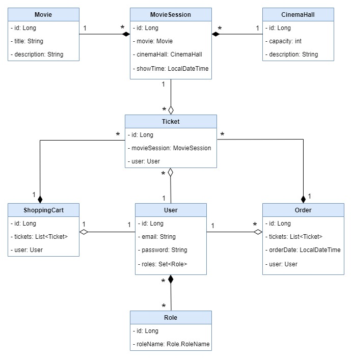

#	📽️ Cinema Ticket Shop

**Java web-application that simulates work of cinema cashbox. It supports user registration and authentication along with ticket ordering procedure.**

### 🎞️️ Feature
---
* Create new movie
* Create new cinema hall
* Create new movie session
* Retrieve movie based on its id
* Retrieve cinema hall based on its id
* Retrieve movie session based on its id
* Display all movies
* Display all cinema sessions
* User registration with password hashing (SHA-512 algorithm and salt)
* User authentication
* Create shopping cart for each user
* Clear shopping cart
* Add tickets to shopping cart
* Complete order for the user based on its shopping cart
* Find all orders of a particular user
* Fing available movie sessions for certain day

###🎞️ Structure
---
The project involves 7 models (see UML diagram)

### 🎞️ Technologies used
---
* JDK 11.0.14
* Maven 3.8.4
* MySql 8.0.22
* Hibernate 5.4.21
* HQL
  ...

### 🎞️ How to run
---
**Requirements**
...
**Instruction**
...
